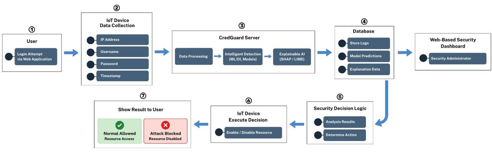
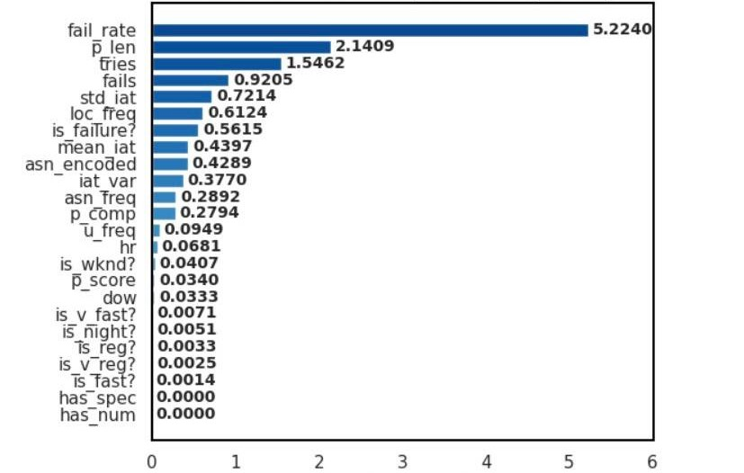
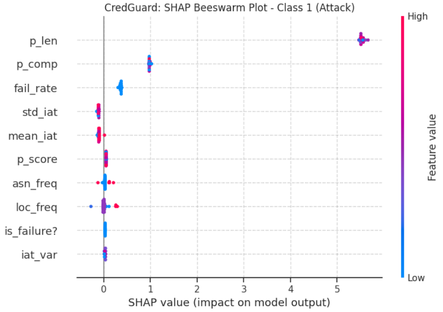
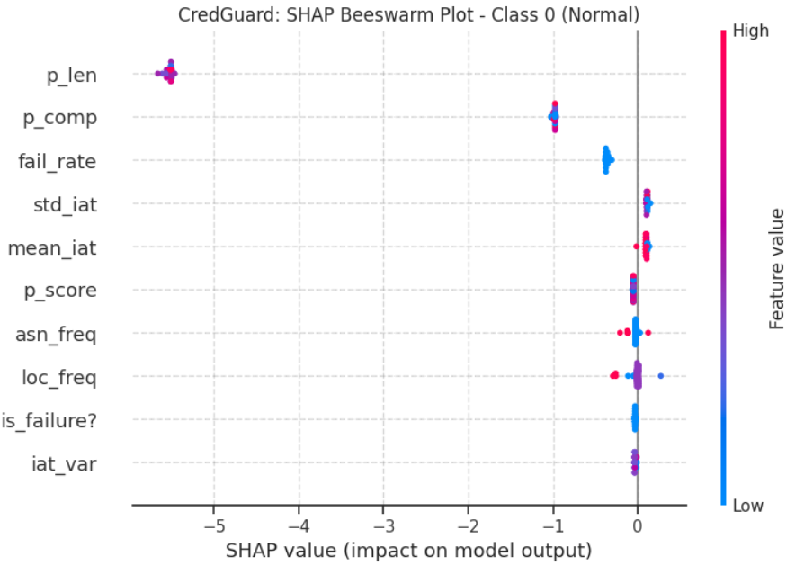
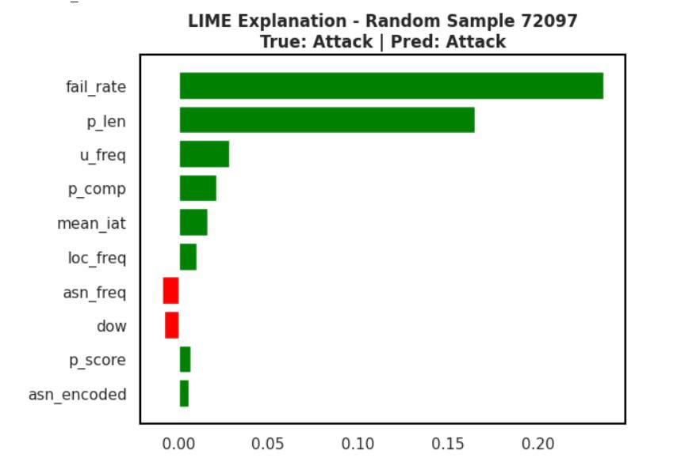
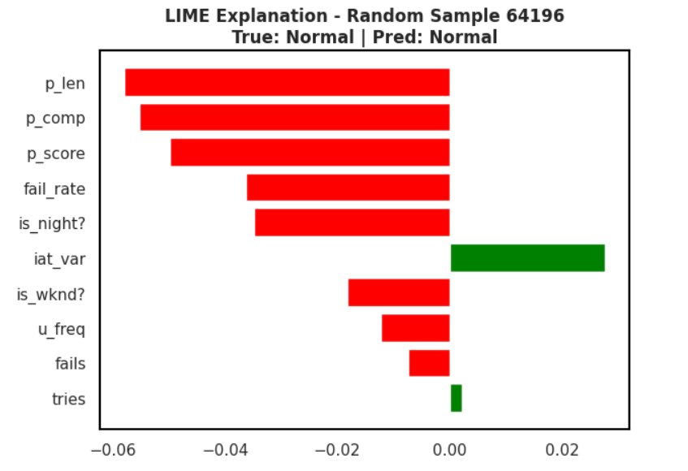
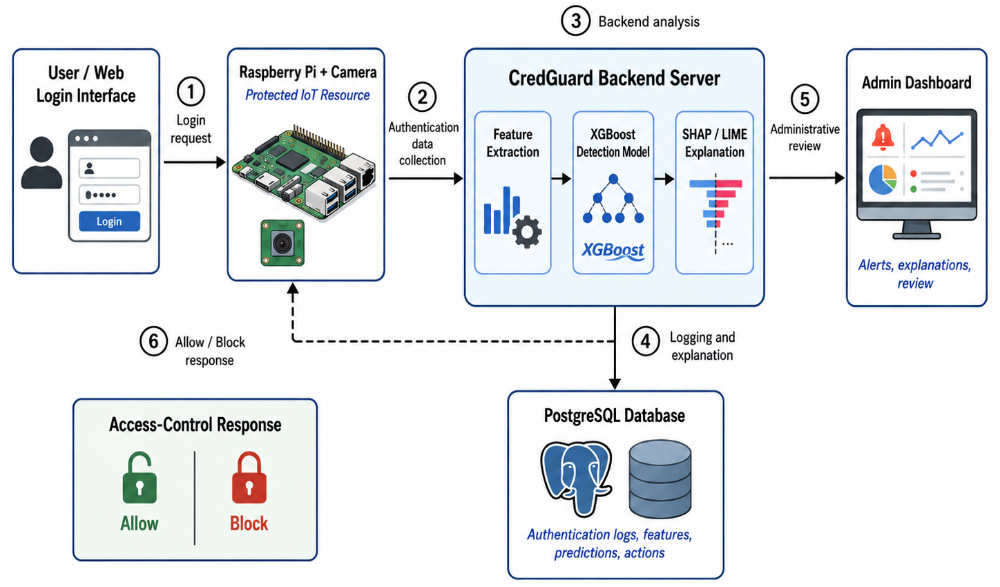

# CredGuard

## Credential-Based Intrusion Detection System Using Explainable AI (XAI) for IoT Environments

CredGuard is a credential-based intrusion detection system designed for IoT environments. The system analyzes authentication attempts using Machine Learning (ML), Deep Learning (DL), and Explainable Artificial Intelligence (XAI) techniques to detect potentially malicious access attempts and support secure access control.

The system consists of an IoT device, a backend server, a PostgreSQL database, and a web-based interface. A Raspberry Pi connected to a Camera Module v2.1 collects authentication-related information, including IP address, username, password, and timestamp, and transmits the data to the backend server for processing and analysis.

---

## System Architecture

The main components of CredGuard include:

- **IoT Device:** A Raspberry Pi connected to a Camera Module v2.1.
- **Backend Server:** Responsible for data processing, preprocessing, feature extraction, model analysis, and decision generation.
- **Machine Learning and Deep Learning Models:** Used to classify authentication attempts as Normal or Attack.
- **Explainable AI:** SHAP and LIME are used to interpret model predictions.
- **PostgreSQL Database:** Stores user information, login attempts, model results, security actions, IoT-related data, and post-login behaviour records.
- **Web Application:** Provides interfaces for the Device Owner and Administrator.

The system supports two primary user roles:

- **Admin:** Monitors system activity, users, model results, and security-related information.
- **Device Owner:** Initiates authentication and interacts with the protected IoT resource through the web application.

---

## CredGuard IoT Dataset

CredGuard IoT is the integrated dataset developed for the project.

The dataset was constructed by integrating five authentication- and intrusion-related data sources:

1. SSH Honeypot Logs
2. Medium-Interaction SSH Honeypot (Cowrie)
3. Synthetic Web Authentication Logs
4. Risk-Based Authentication (RBA)
5. SSH Brute-Force Attempt Dataset

The integrated dataset provides authentication-related information used for credential-based intrusion detection.

The dataset includes features such as:

- Timestamp
- Source IP address
- Username
- Password
- ASN
- Location
- Authentication status
- Source
- Label
- Inter-arrival time
- Login attempts
- Failed attempts
- Failure ratio
- Mean inter-arrival time
- Standard deviation of inter-arrival time
- Password length
- Password complexity
- Day of week
- Hour
- Cyclic time features

ASN and geographic location information are obtained from the source IP address using the IPinfo service.

---

## Data Processing and Feature Engineering

The data processing pipeline includes schema alignment, integration of heterogeneous sources, status normalization, duplicate removal, critical-field filtering, credential completion, network enrichment, and temporal standardization.

Temporal and behavioural features are generated from ordered authentication attempts.

The feature-engineering process includes:

- Inter-arrival time (IAT)
- Mean and standard deviation of inter-arrival time
- Login-attempt progression
- Failure ratio
- Password length
- Password complexity
- Cyclic hour encoding using sine and cosine transformations
- ASN and geographic location

Temporal features are calculated using historical information associated with the source IP to avoid using future information during feature construction.

---

## Machine Learning and Deep Learning Models

CredGuard evaluates multiple Machine Learning and Deep Learning models for authentication-based intrusion detection.

The evaluated models are:

- XGBoost
- Random Forest
- Support Vector Machine (SVM)
- Convolutional Neural Network (CNN)
- Recurrent Neural Network (RNN)
- Deep Neural Network (DNN)

The dataset is partitioned into:

- **70% Training**
- **15% Validation**
- **15% Testing**

`Attack` is treated as the positive class and `Normal` as the negative class.

### Model Performance

| Model | Accuracy | Precision | Recall | F1-Score | Training Time (s) |
|---|---:|---:|---:|---:|---:|
| XGBoost | 82.29% | 85.06% | 75.45% | 79.97% | 82 |
| Random Forest | 82.03% | 86.90% | 76.02% | 81.10% | 585 |
| SVM | 71.21% | 75.10% | 64.62% | 69.47% | 54.43 |
| CNN | 80.50% | 77.55% | 86.60% | 81.82% | 2640.02 |
| RNN | 80.94% | 79.04% | 84.90% | 81.87% | 3794 |
| DNN | 80.22% | 78.07% | 84.79% | 81.29% | 2857 |

Based on the reported evaluation, XGBoost was selected as the final model considering the balance between predictive performance and computational efficiency.

An LSTM model was also implemented but excluded from the reported model comparison because of its sequential processing requirements and longer training time.

---

## Explainable AI

CredGuard incorporates Explainable AI techniques to improve the interpretability of model predictions.

Two XAI techniques are used:

- **SHAP (SHapley Additive exPlanations):** Used to analyze feature contributions and global feature importance.
- **LIME (Local Interpretable Model-Agnostic Explanations):** Used to provide local explanations for individual predictions.

These techniques provide interpretable information about model classification results and support analysis of why an authentication attempt is classified as Normal or Attack.

### SHAP Analysis

### LIME Analysis

## Post-Login User Behaviour Analysis

In addition to authentication-based detection, CredGuard performs post-login user behaviour analysis.

After successful authentication, the system continuously monitors user behaviour during the session. The analysis considers activities such as session duration, live-stream viewing, camera interactions, and full-screen usage.

When sufficient historical data are available, the system constructs a behavioural baseline for the user and compares the current session with the user's previous behaviour. When historical data are insufficient, rule-based heuristics are used to estimate the risk level.

The system computes a Risk Score ranging from 0 to 100 and classifies the session into:

- **Low Risk:** Normal behaviour
- **Medium Risk:** Suspicious behaviour
- **High Risk:** Abnormal and high-risk behaviour

High-risk sessions may be terminated or blocked according to the system's decision process.

---

## IoT Integration

The IoT component consists of a Raspberry Pi 3 Model B+ connected to a Raspberry Pi Camera Module v2.1.

The Raspberry Pi collects authentication-related information and communicates with the backend server. The backend performs the required processing and analysis and generates an access-control decision.

The resulting decision is communicated to the IoT device and the web application. The Raspberry Pi executes the access-control decision received from the backend.

The IoT implementation also supports live video streaming, image snapshot capture, and video recording through the Raspberry Pi Camera Module.

---

## Database

PostgreSQL is used as the project's database and is integrated with the Flask backend through Flask-SQLAlchemy.

The database stores information related to:

- User accounts
- Login attempts
- Model predictions
- Security actions
- IoT device data
- Post-login behaviour
- User activity records
- Behaviour-related explanations

Passwords are not stored in plaintext. Password hashing and verification are used for user authentication.

---

## Technologies

The project uses the following technologies and tools:

- Python
- Scikit-learn
- TensorFlow / Keras
- XGBoost
- SHAP
- LIME
- Flask
- Flask-SQLAlchemy
- PostgreSQL
- Jupyter
- Google Colab
- Kaggle
- Raspberry Pi
- Raspberry Pi Camera Module v2.1

---

## Project Team

CredGuard was developed by:

- Renad Sultan Alamri
- Shaima Shedaid Alharbi
- Kadi Nawaf Alotaibi
- Aisha Abdulrahman Alranini
- Alaa Hani Alraddadi
- Rahaf Ahmed Alkhulaifi

**Supervisor:** Prof. Fatemah Mordhi Alharbi

---

## Repository Contents

The repository contains the project documentation, dataset, model development notebooks, figures, and supporting files.

- `Data/` — CredGuard IoT dataset and related data files
- `Figures/` — Project figures and visual materials
- `Scripts/` — Model development and training notebooks
- `README.md` — Project overview and documentation
- `REPRODUCIBILITY.md` — Reproducibility details
- `requirements.txt` — Python package dependencies
- `CITATION.cff` — Citation metadata
- `LICENSE` — Project license

---

## License

This project is distributed under the MIT License.
